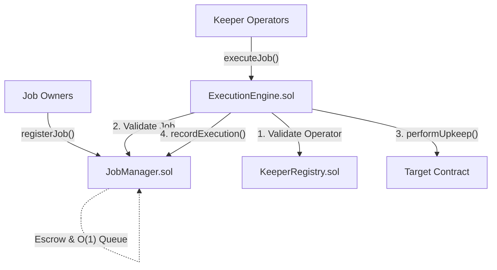

<div align="center">


# On-Chain Automation Protocol
### Base Mainnet · Permissionless · Slashing-Secured
 
<br>

[](https://opensource.org/licenses/MIT)
[](https://book.getfoundry.sh/)
[](https://basescan.org/)
[](#-security-model)

<br>

> **A fully decentralized automation protocol for Ethereum smart contracts.**<br>
> Keepers bond ETH to a slashing-secured registry, then compete to execute due jobs 
> through a fault-isolated batch router, earning rewards from a pull-payment vault.

<br>

<a href="https://on-chain-automation-protocol.vercel.app/" target="_blank">🌐 Live DApp</a> &nbsp;·&nbsp;
<a href="https://basescan.org/address/0xcEa37b9CCA6170d43BF133CCfdeaD9CB2A4D61D3" target="_blank">🔗 Core Registry</a>

</div>

---

## 📖 Overview

Smart contracts are inherently passive. they cannot wake themselves up to execute time-sensitive tasks like liquidating undercollateralized loans, compounding DeFi yield, or distributing epoch rewards. 

The **On-Chain Automation Protocol (Keeper Network)** solves this by abstracting execution into a decentralized layer. Developers simply register their smart contract as a "Job" and fund a reward pool. A permissionless network of financially staked operators (Keepers) continuously monitors these jobs off-chain. The moment a job's conditions are met, keepers race to execute the transaction on-chain. Honest execution earns a cut of the reward pool, while malicious or faulty execution results in the keeper's staked ETH being instantly slashed. 

---

## 🎯 Why This Matters

Most automation protocols rely on centralized cron-bots or permissioned multisigs to trigger execution. This protocol replaces that single point of failure with an **economically secured, permissionless network** of independent operators.

| Traditional Automation | Keeper Network Solution |
| :--- | :--- |
| **Centralized Failure** (Bot crashes, system halts) | **Decentralized Execution** (Any bonded keeper can step in) |
| **No Accountability** (Malicious triggers cost nothing) | **Economic Security** (ETH bonding, automated slashing, permanent jailing) |
| **Batch Vulnerability** (One failing job reverts everything) | **Fault Isolation** (`try/catch` isolation per job in the Execution Engine) |
| **Gas Bloat** (Unbounded arrays degrade performance) | **O(1) Efficiency** (Swap-and-pop active job list) |

---

## 🏛️ Tri-Contract Architecture

The protocol is split into three strictly isolated layers. A bug in execution logic can never reach the keeper bonds, and a bug in the registry can never reach the job escrow funds.



### 1. `KeeperRegistry.sol` (The Trust Anchor)

Manages operator identities, ETH bonds, and slashing. Unbonding requires a strict two-step cooldown. Slashing automatically deducts from the bond, and accumulating 3 slashes triggers an autonomous, permanent jail state.

### 2. `JobManager.sol` (The Accounting Ledger)

Stores execution intents and user-funded reward pools. Tracks active jobs using a highly optimized `O(1)` swap-and-pop array. Employs a pure pull-payment pattern for treasury fees to prevent DoS attack vectors.

### 3. `ExecutionEngine.sol` (The Stateless Router)

The only contract that interacts with external user code. It wraps every target call in a `try/catch` boundary. If a malicious user contract intentionally reverts to trap gas, the failure is isolated and the batch queue continues uninterrupted. It holds absolutely zero ETH.

---

## 🔒 Security Model

The system operates under the assumption that actors will eventually act maliciously. Security is enforced mathematically.

* **CEI Compliance:** All state-changing functions follow Checks-Effects-Interactions strictly.
* **Reentrancy Protection:** `ReentrancyGuard` secures all external calls and pull-payments.
* **Gas Griefing Protection:** Users set a `maxBaseFee` ceiling; if the network base fee exceeds this, the job safely skips.
* **Math Clamping:** Reputation scores are mathematically bounded (`0 - 1000`) to prevent integer overflow gaming.
* **Static Analysis:** Thoroughly reviewed via Slither (v0.10) with **0 Critical, 0 High** findings.

---

## ✅ Deployed Contracts

Live, verified, and operational on **Base Mainnet** (Chain ID: `8453`).

| Component | Contract Address |
| --- | --- |
| **KeeperRegistry** | [`0xcEa37b9CCA6170d43BF133CCfdeaD9CB2A4D61D3`](https://basescan.org/address/0xcEa37b9CCA6170d43BF133CCfdeaD9CB2A4D61D3) |
| **JobManager** | [`0xBAa2B4c250DD6da358e23244C2fa85dA1927718C`](https://basescan.org/address/0xBAa2B4c250DD6da358e23244C2fa85dA1927718C) |
| **ExecutionEngine** | [`0x388665c32F9F17E0d5cfEE3Eabe1880A3AEd80e9`](https://basescan.org/address/0x388665c32F9F17E0d5cfEE3Eabe1880A3AEd80e9) |

---

## 🛠️ Local Setup & Testing

Built entirely using the [Foundry](https://book.getfoundry.sh/) toolchain.

```bash
git clone [https://github.com/NexTechArchitect/OnChain-Automation-Protocol.git](https://github.com/NexTechArchitect/OnChain-Automation-Protocol.git)
cd OnChain-Automation-Protocol

# Install dependencies and build
forge install
forge build

# Execute the test suite
forge test -vvv

```
<div align="center">

#### Architected & Engineered by [NexTech Architect**](https://github.com/NexTechArchitect)

#### Smart Contract Developer · Solidity · Foundry · Full Stack Web3
